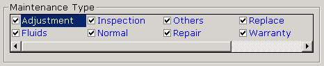

## Display Checkboxes in Listbox  Horizontally

### Description

Display Checkboxes in Listbox Horizontally

I've been searching the internet and PSC on how to display checkboxes in a listbox in a horizontal manner but I didn't found any. Perhaps my search keywords are wrong but really I found nothing.

I decided to re-examine the listbox property if I can find something that I have overlooked before and there it is. Who would have thought that by merely CHANGING THE COLUMNS PROPERTY TO ANY NUMBER OTHER THAN 0 WOULD ACCOMPLISH WHAT I WANTED TO DO.

Many of you may have already known this but for newbies out there, this might help. See the screenshot to see what I mean.

For the screenshot below, the setting is:

Listbox1.columns = 4

OR

In the properties list, change Columns = 0 to Columns = any number you want.

The number of columns specified will configure the listbox to show 4 columns in its display window. A horizontal scrollbar will be displayed if the data display occupies more than 4 columns.
 
### More Info
 

             |
---                |---
**Submitted On**   |
**By**             |[Erick Asas](https://github.com/Planet-Source-Code/PSCIndex/blob/master/ByAuthor/erick-asas.md)
**Level**          |Beginner
**User Rating**    |4.4 (35 globes from 8 users)
**Compatibility**  |VB 5\.0, VB 6\.0
**Category**       |[Custom Controls/ Forms/  Menus](https://github.com/Planet-Source-Code/PSCIndex/blob/master/ByCategory/custom-controls-forms-menus__1-4.md)
**World**          |[Visual Basic](https://github.com/Planet-Source-Code/PSCIndex/blob/master/ByWorld/visual-basic.md)
**Archive File**   |

### Source Code

Happy Programming!

